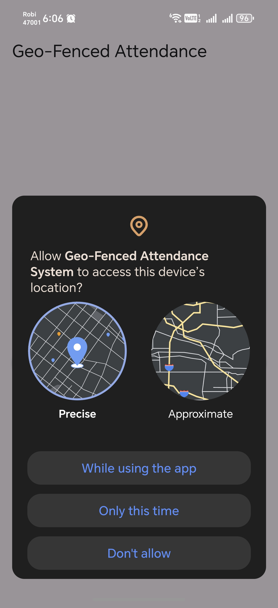
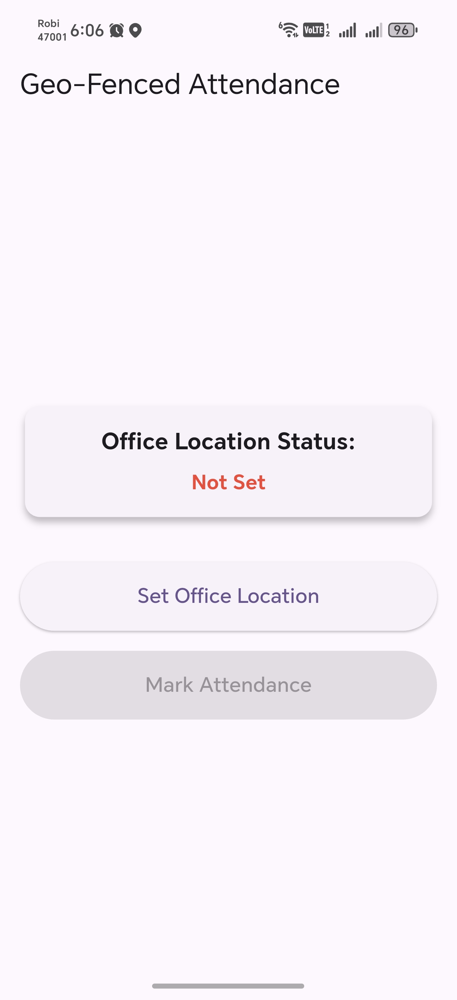
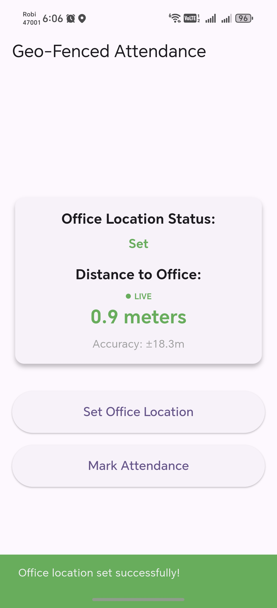
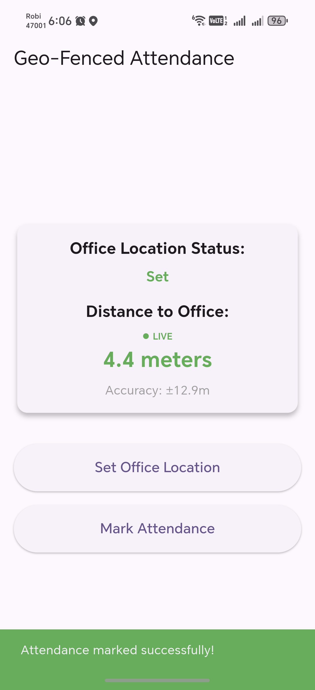

# Geo-Fenced Attendance System

A production-ready Flutter application for location-based attendance marking. The system ensures that employees can only mark their attendance when they are physically within a 50-meter radius of the designated office location.

## Features
- **Office Setup**: Set the current GPS location as the "Office Location".
- **Real-Time Tracking**: Live distance indicator that updates as the user moves.
- **Geo-Fencing**: Dynamic "Mark Attendance" button enabled only within a 50m radius.
- **Persistence**: Office location is saved locally using Hive.
- **Permissions**: Graceful handling of location permissions and GPS service status.

## Technical Stack
- **Framework**: [Flutter](https://flutter.dev/)
- **State Management**: [flutter_bloc](https://pub.dev/packages/flutter_bloc) (BLoC Pattern)
- **Local Storage**: [Hive](https://pub.dev/packages/hive)
- **Location Services**: [geolocator](https://pub.dev/packages/geolocator)
- **Functional Programming**: [dartz](https://pub.dev/packages/dartz) (Either for error handling)
- **Dependency Injection**: [get_it](https://pub.dev/packages/get_it)
- **Object Comparison**: [equatable](https://pub.dev/packages/equatable)

## Project Structure / Approaches
The project follows **Clean Architecture** principles, separated into three main layers:

1. **Domain Layer**: Contains Business Logic.
   - **Entities**: Simple data objects (`LocationEntity`).
   - **Repositories**: Abstract definitions of data operations.
   - **Use Cases**: Specific business rules (`MarkAttendance`, `SetOfficeLocation`, `GetLocationStream`).

2. **Data Layer**: Handles data retrieval and storage.
   - **Models**: Data transfer objects with JSON/Hive serialization.
   - **Data Sources**: Remote (Geolocator) and Local (Hive) implementations.
   - **Repository Implementation**: Coordinates between different data sources.

3. **Presentation Layer**: UI and State Management.
   - **BLoC**: `AttendanceBloc` manages all events like `CheckInitialLocationEvent`, `SetOfficeLocationEvent`, and `RealTimeLocationUpdateEvent`.
   - **Widgets**: Reusable components and the main `AttendanceScreen`.

## Screenshots

<p align="center">
  
  
  
  
</p>

## Download APK
You can download the latest release APK from the link below:
- [🚀 Download Release APK](https://github.com/rktuhinbd/IntelligentTask-1/releases/download/v1.0.0/app-release.apk)

*Note: If the link above isn't active yet, please ensure you have created a release tagged `v1.0.0` on GitHub and uploaded the `app-release.apk` file.*

## How to Run
1. **Clone the repository**:
   ```bash
   git clone https://github.com/rktuhinbd/IntelligentTask-1.git
   cd IntelligentTask-1
   ```
2. **Install dependencies**:
   ```bash
   flutter pub get
   ```
3. **Run the application**:
   ```bash
   flutter run
   ```

---
Developed as a demonstration of Clean Architecture and Real-Time Geo-Fencing in Flutter.
